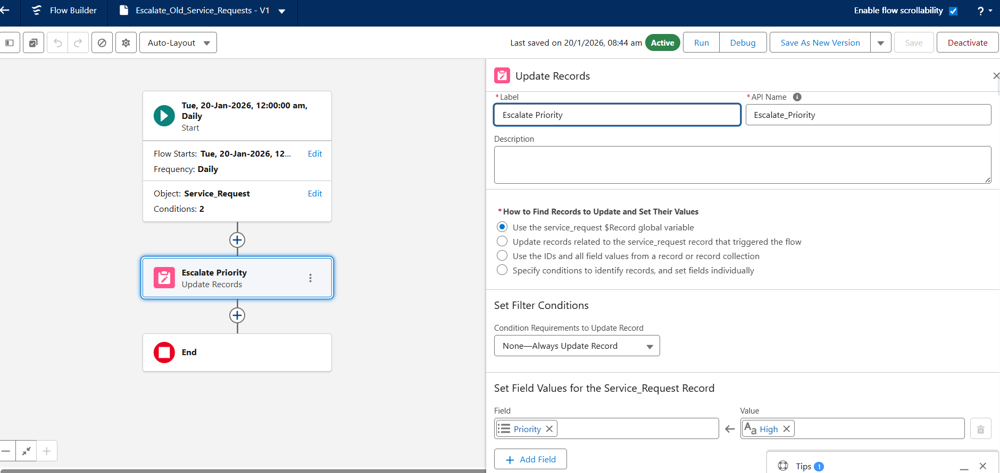

# Scheduled Flow

This flow runs every day to identify Service Requests that are **In Progress** for more than 7 days.

It automatically updates the priority to **High**.

---

## Scheduled Flow Screenshot

---

## Flow Logic

1. **Run Schedule**
- Runs daily

2. **Find Records**
- Object: Service Request
- Condition: Status = In Progress
- Condition: CreatedDate older than 7 days

3. **Update Records**
- Priority = High

---

## Summary

This automation helps to escalate delayed service requests automatically.

