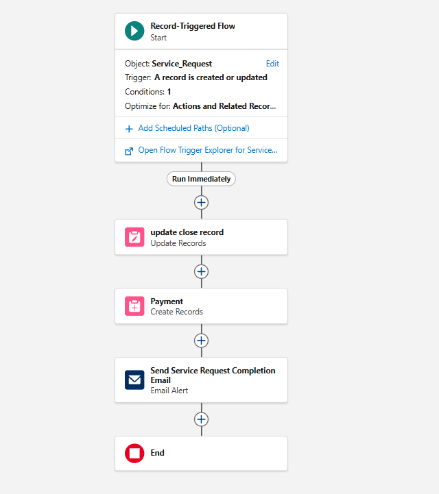

# Record Triggered Flow

This automation is implemented using a **Record-Triggered Flow** in Salesforce.

The flow automatically executes when the **Status** of a Service Request
is updated to **Completed**.

### Flow Actions

Once the condition is met, the flow performs the following actions:

1. Updates the **Closed Date** of the Service Request
2. Creates a **Payment** record linked to the Service Request
3. Sends an **Email Notification** to the customer

This automation reduces manual effort and ensures timely payment processing.
